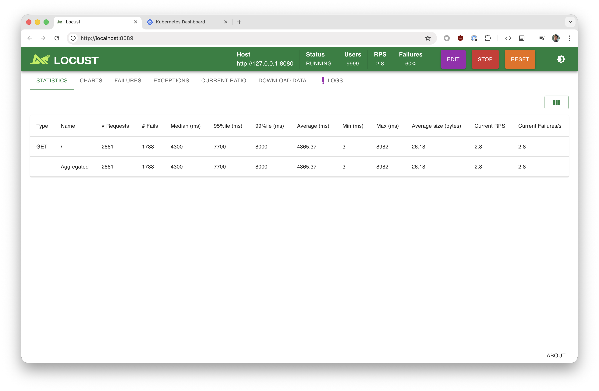
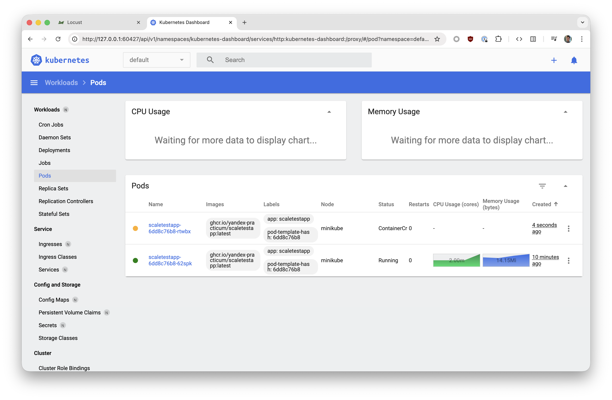
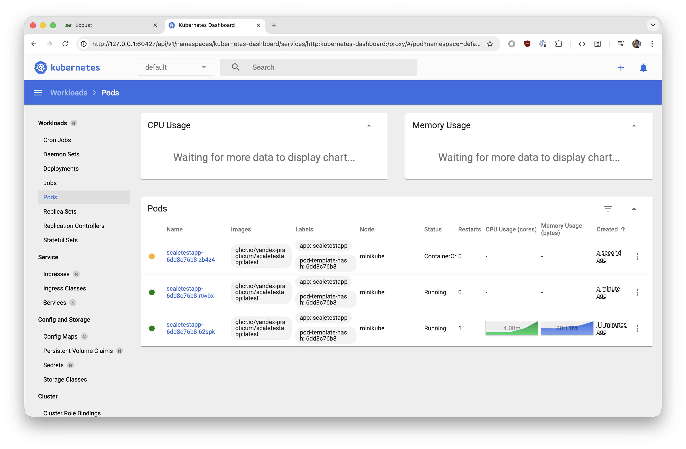
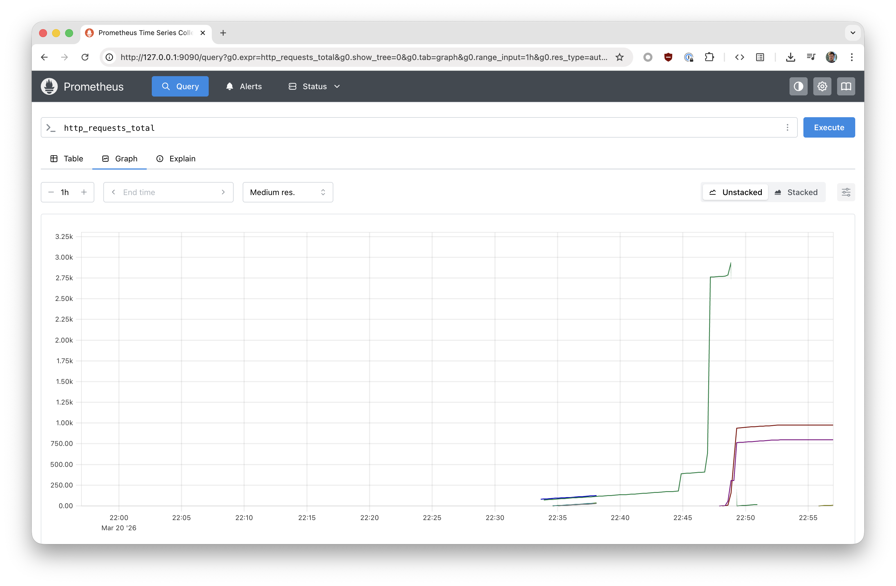
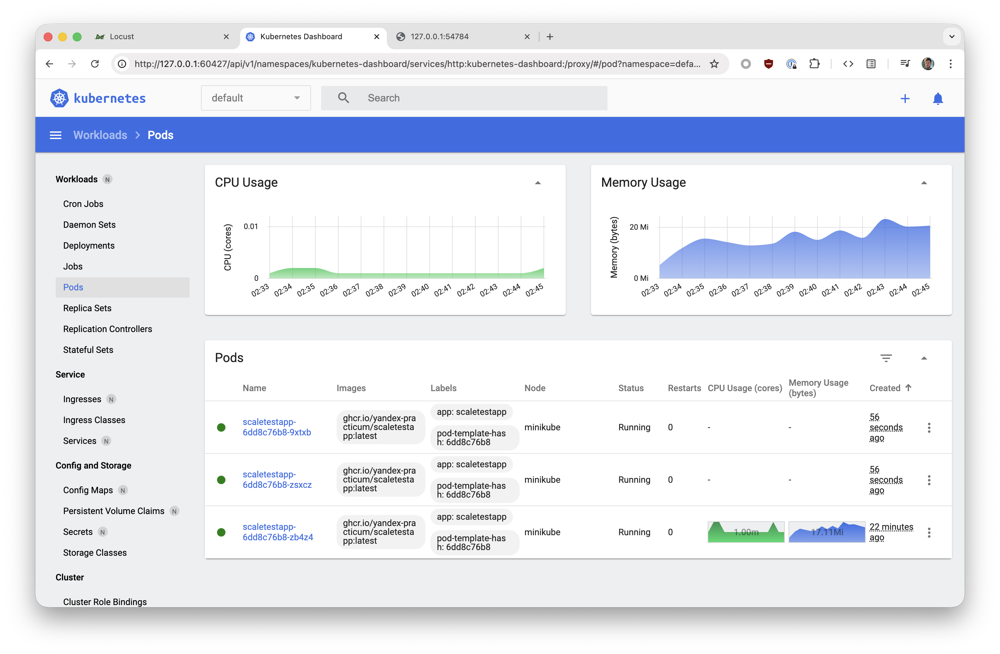

# Задание 2. Динамическое масштабирование контейнеров

## Часть 1: Масштабирование по памяти

### Команды

```bash
minikube start
minikube addons enable metrics-server
```

```bash
kubectl apply -f deployment.yaml
kubectl apply -f service.yaml
kubectl apply -f hpa-memory.yaml
```

```bash
kubectl get pods -l app=scaletestapp
kubectl get hpa scaletestapp-memory-hpa
```

```bash
kubectl port-forward svc/scaletestapp 8080:80
```

```bash
source ../.venv/bin/activate
pip install -r requirements.txt
locust -f locustfile.py --host http://127.0.0.1:8080
```

```bash
minikube dashboard
```

```bash
kubectl get events --field-selector reason=SuccessfulRescale
```

### Результат

Скриншоты:







Лог:

```
❯ kubectl get events --field-selector reason=SuccessfulRescale
LAST SEEN   TYPE     REASON              OBJECT                                            MESSAGE
3m23s       Normal   SuccessfulRescale   horizontalpodautoscaler/scaletestapp-memory-hpa   New size: 2;reason: memory resource utilization (percentage of request) above target
2m23s       Normal   SuccessfulRescale   horizontalpodautoscaler/scaletestapp-memory-hpa   New size: 3;reason: memory resource utilization (percentage of request) above target
```

## Часть 2: Масштабирование по RPS через Prometheus

### Команды

```bash
helm repo add prometheus-community https://prometheus-community.github.io/helm-charts
helm repo update
helm install prometheus prometheus-community/kube-prometheus-stack \
  -n monitoring --create-namespace \
  -f prometheus-values.yaml
```

```bash
kubectl apply -f service-monitor.yaml
```

```bash
kubectl port-forward -n monitoring svc/prometheus-kube-prometheus-prometheus 9090:9090
```

```bash
helm install prometheus-adapter prometheus-community/prometheus-adapter \
  -n monitoring \
  -f prometheus-adapter-values.yaml
```

```bash
kubectl get --raw "/apis/custom.metrics.k8s.io/v1beta1" | python3 -m json.tool | grep http_requests
```

```bash
kubectl delete hpa scaletestapp-memory-hpa
kubectl scale deployment scaletestapp --replicas=1
kubectl apply -f hpa-rps.yaml
```

```bash
kubectl get hpa scaletestapp-rps-hpa
```

### Результат

Скриншоты:





Лог:

```
❯ kubectl get events --field-selector reason=SuccessfulRescale
LAST SEEN   TYPE     REASON              OBJECT                                            MESSAGE
24m         Normal   SuccessfulRescale   horizontalpodautoscaler/scaletestapp-memory-hpa   New size: 2;reason: memory resource utilization (percentage of request) above target
23m         Normal   SuccessfulRescale   horizontalpodautoscaler/scaletestapp-memory-hpa   New size: 3;reason: memory resource utilization (percentage of request) above target
15m         Normal   SuccessfulRescale   horizontalpodautoscaler/scaletestapp-memory-hpa   New size: 5;reason: memory resource utilization (percentage of request) above target
2m          Normal   SuccessfulRescale   horizontalpodautoscaler/scaletestapp-rps-hpa      New size: 3;reason: pods metric http_requests_per_second above target
```
