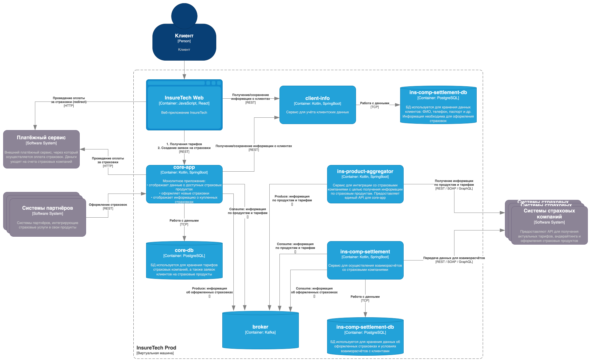

# Задание 3. Переход на Event-Driven архитектуру

## AS IS

- У сервисов `core-app` и `ins-comp-settlement` хранятся свои копии списка продуктов и тарифов. `core-app` обновляет их из `ins-product-aggregator` каждые 15 минут, `ins-comp-settlement` - один раз в сутки.
- Раз в сутки `ins-comp-settlement` по REST забирает у `core-app` все страховки, оформленные за прошедший день.
- Сервис `ins-product-aggregator` при каждом обращении сам ходит ко всем страховым компаниям (сейчас их пять), собирает ответы в один список и отдаёт его вызывающей стороне в том же запросе, без отложенной обработки.
- Пока ответ не собран целиком, клиент ждёт самую медленную или отказавшую интеграцию. Когда страховщиков станет больше, это время и число сбоев будут только расти.
- Оба потребителя каталога сами по расписанию запрашивают одни и те же данные у агрегатора - нагрузка дублируется, а копии у `core-app` и у `ins-comp-settlement` могут на часы расходиться по свежести.
- Ночной массовый запрос из `ins-comp-settlement` в `core-app` связывает расчёты с партнёрами с работоспособностью `core-app`: если он недоступен, цепочка расчётов страдает.
- Разное время обновления локальных копий каталога повышает риск того, что в разных частях системы одновременно живут разные версии тарифов.

## TO BE

Между сервисами - брокер сообщений (Kafka): агрегатор публикует факты об изменении каталога, подписчики подтягивают их в свои базы; оформление полиса в `core-app` превращается в событие, которое читает `ins-comp-settlement`, без суточного REST.

Для событий, где важна гарантия доставки (деньги, отчётность), нужен паттерн Transactional Outbox.

